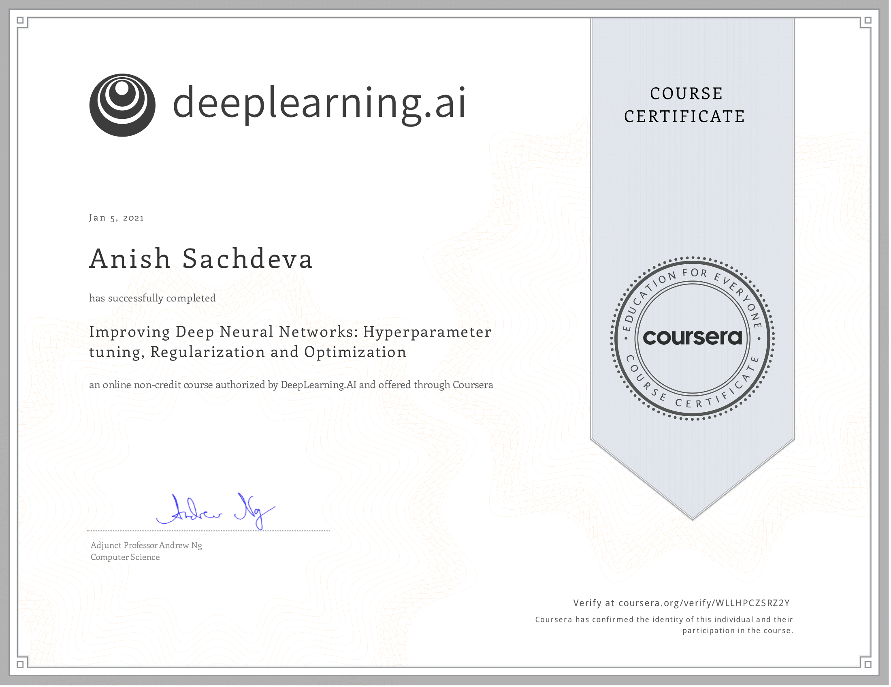

# Improving Deep Neural Networks: Hyperparameter Tuning, Regularization and Optimization @Coursera

__Course by deeplearning.ai__

This is part of the 5 course specialization on 
[Deep Learning](https://github.com/anishLearnsToCode/deep-learning-ai) 
on Coursera. This is the second course.

## 📖 Overview
- [Week 1](#week-1)
- [Week 2](#week-2)
- [Week 3](#week-3)
- [Certificate](#-certificate)

## Week 1
- [Quiz: Practical Applications of Deep Learning](week_1/quiz-practical-aspects-of-deep-learning.md)
- [Programming Assignment: Initialization](week_1/initialization/Initialization.ipynb)
- [Programming Assignment: Regularization](week_1/regularization/Regularization_v2a.ipynb)
- [Programming Assignment: Gradient Checking](week_1/gradient-checking/Gradient+Checking+v1.ipynb)

## Week 2
- [Quiz: Optimization Algorithms](week_2/quiz-optimization-algorithms.md)
- [Programming Assignment: Optimization](week_2/optimization-methods/Optimization_methods_v1b.ipynb)

## Week 3
- [Quiz: Hyperparameter Tuning, Batch Normalization](week_3/quiz-hyperparameter-tuning-batch-normalization.md)
- [Programming Assignment: Tensorflow](week_3/tensorflow-tutorial/TensorFlow_Tutorial_v3b.ipynb)

## 🎓 [Certificate](https://coursera.org/verify/WLLHPCZSRZ2Y)

